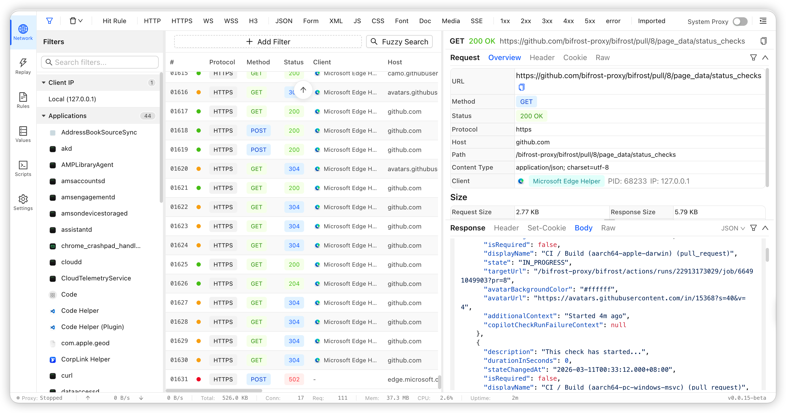
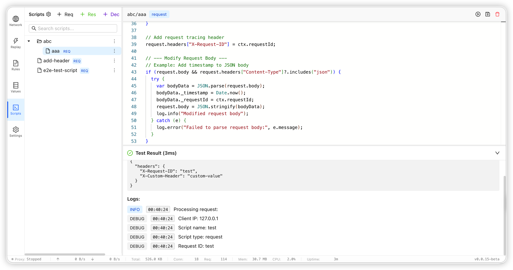
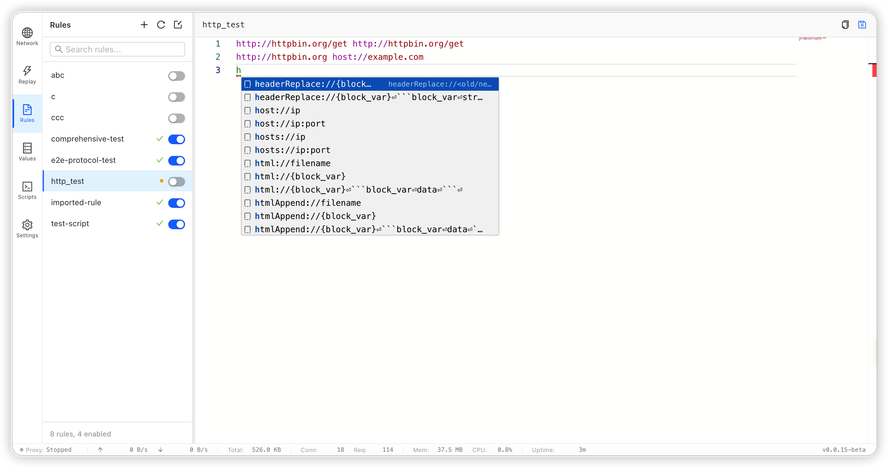
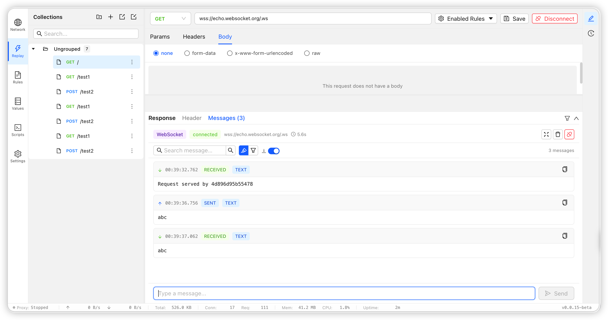
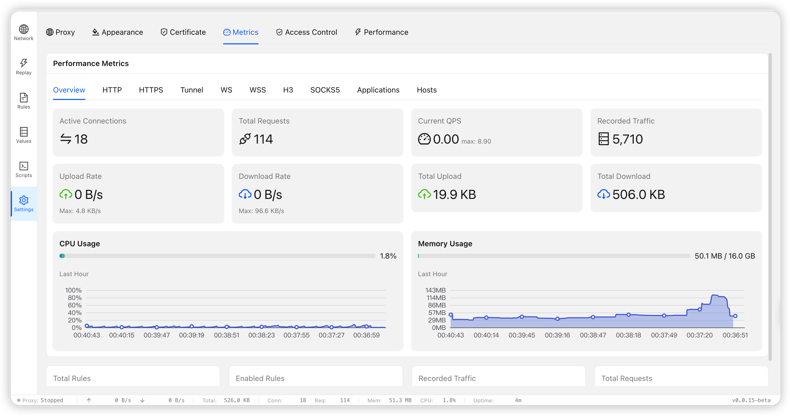

# Bifrost

<p align="center">
  <strong>高性能 HTTP/HTTPS/SOCKS5 代理服务器</strong>
</p>

<p align="center">
  <a href="https://github.com/bifrost-proxy/bifrost/actions"></a>
  <a href="https://github.com/bifrost-proxy/bifrost/releases"></a>
  <a href="https://github.com/bifrost-proxy/bifrost/releases"></a>
  <a href="https://github.com/bifrost-proxy/bifrost/blob/main/LICENSE"></a>
</p>

> 帮助文档：<https://bifrost-proxy.github.io/bifrost>

Bifrost 是一个用 Rust 编写的高性能代理服务器，灵感来源于 [Whistle](https://github.com/avwo/whistle)。它提供请求拦截、规则修改、TLS 拦截、脚本扩展、流量查看、请求重放以及 Web UI 管理能力。

## 特性说明








- 高性能代理内核：基于 Tokio + Hyper，支持高并发与连接复用
- 多协议支持：HTTP/1.1、HTTP/2、HTTP/3、HTTPS、SOCKS5、WebSocket、SSE、gRPC
- TLS 拦截能力：支持 CA 证书生成、按域名动态签发证书、按规则选择拦截或透传
- 规则引擎：支持路由、请求/响应改写、注入、延迟、限速、Mock、脚本处理
- 管理界面：内置 Web UI，支持规则编辑、流量查看、脚本管理、请求重放
- 资源风险告警：Performance 页与 `/_bifrost/api/system/memory` 会显示 body/ws 文件 writer 占用及接近句柄上限的告警状态
- 脚本沙箱：基于 QuickJS，支持 `reqScript`、`resScript`、`decode`

## 快速开始

安装 CLI：

方法一：使用脚本安装
```bash
curl -fsSL https://raw.githubusercontent.com/bifrost-proxy/bifrost/main/install-binary.sh | bash
```

方法二：使用 npm 安装
```bash
npm i @bifrost-proxy/bifrost
```

更多安装方法：[`docs/getting-started.md`](docs/getting-started.md)

启动代理：

```bash
bifrost start -d
```

启动后访问管理端：

```text
http://127.0.0.1:9900/_bifrost/
```


## 基本用法摘要

常见命令：

```bash
# 查看状态
bifrost status

# 停止服务
bifrost stop

# 查看流量
bifrost traffic list
bifrost traffic search "keyword" --method POST --host api.openai.com --path /v1/responses
bifrost search "keyword" --req-header
bifrost search "keyword" --res-body

# 添加规则
bifrost rule add local-dev --content "example.com host://127.0.0.1:3000"
```

搜索命令补充说明：

- `bifrost search` 与 `bifrost traffic search` 等价
- 基础过滤支持 `--method`、`--host`、`--path`、`--status`、`--protocol`
- 搜索范围支持 `--url`、`--req-header`、`--res-header`、`--req-body`、`--res-body`
- 兼容别名：`--headers` 会同时搜索请求头和响应头，`--body` 会同时搜索请求体和响应体

规则示例：

```txt
example.com host://127.0.0.1:3000
api.example.com reqHeaders://x-debug=1
chatgpt.com http3://
```

## 文档索引

- 文档总览：[`docs/README.md`](docs/README.md)
- 项目概览：[`docs/overview.md`](docs/overview.md)
- 安装与启动：[`docs/getting-started.md`](docs/getting-started.md)
- CLI 详细命令：[`docs/cli.md`](docs/cli.md)
- 桌面版安装与构建：[`docs/desktop.md`](docs/desktop.md)
- 规则语法：[`docs/rule.md`](docs/rule.md)
- 操作符说明：[`docs/operation.md`](docs/operation.md)
- 匹配模式：[`docs/pattern.md`](docs/pattern.md)
- 规则协议手册：[`docs/rules/README.md`](docs/rules/README.md)
- Scripts 模块与脚本开发：[`docs/scripts.md`](docs/scripts.md)
- Values 使用说明：[`docs/values.md`](docs/values.md)
- 请求重放说明：[`docs/replay.md`](docs/replay.md)
- 项目结构与模块说明：[`docs/architecture.md`](docs/architecture.md)
- Agent Skill 安装说明：[`docs/agent-skill.md`](docs/agent-skill.md)
