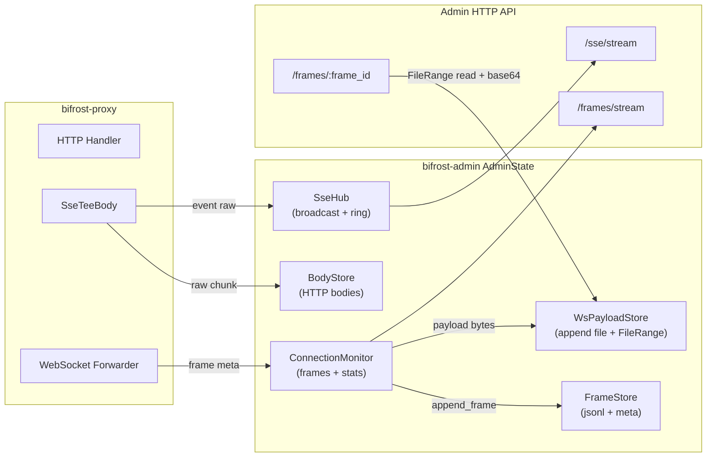
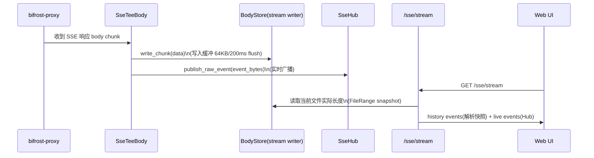
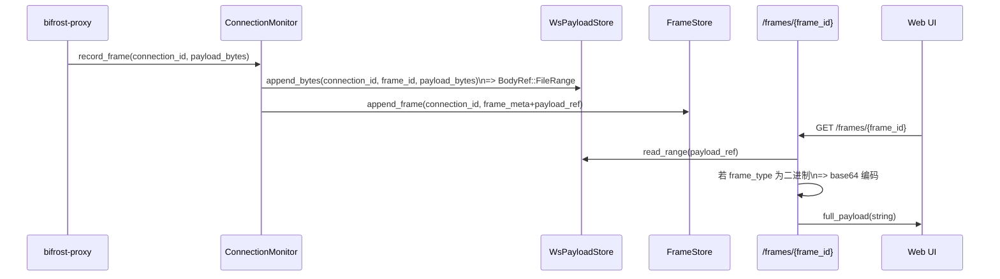
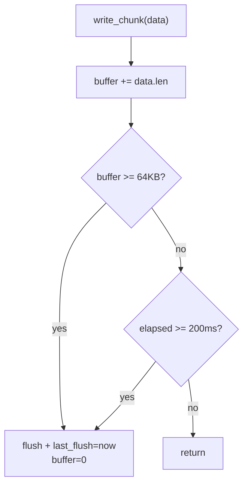

# SSE/WS 数据持久化与性能优化方案

## 背景与问题

- SSE/WebSocket 数据抓取与落盘在高频流量下可能导致 CPU 过高
  - 高频小写：SSE raw stream 每个 chunk 直接 `write_all`
  - 写放大：WS 每帧一个文件（create/open/write/close）+ 海量小文件
  - 编码/序列化：WS 二进制帧写路径 Base64；FrameStore 写路径 `serde_json::to_string`
  - 锁竞争：关键路径持有全局 write lock 时叠加 IO/编码成本，放大 CPU

## 目标

- 显著降低 SSE/WS 写路径 CPU 与 syscall 次数，避免高频流量下 CPU 异常
- 控制内存增长：SSE raw stream 采用 write-behind buffer，按 64KB/200ms 刷新
- 控制磁盘写放大：WS payload 从“每帧一个文件”调整为“按连接追加文件 + FileRange 引用”
- 保持对外语义不变：UI/接口仍返回字符串 payload；二进制仍以 Base64 字符串展示

## 方案设计

### 已确认的关键决策

- WS 二进制帧：写路径存原始 bytes；读详情接口按 `frame_type` Base64 编码后返回字符串
- SSE raw stream：flush 策略为 64KB/200ms（任一满足即 flush；连接结束强制 flush）

### 核心架构图

### 关键流程图（写路径与读路径）

#### SSE：写入与订阅

#### WS：录帧与详情读取

### 详细设计

#### SSE：raw stream write-behind buffer

**目标**

- 将“每 chunk 直接 write”改为“缓冲写 + 定期 flush”，降低 syscall 与 CPU
- flush 可见性上界：最大延迟 200ms，最大缓冲 64KB

**写入策略**

- `write_chunk(data)`：
  - 先写入内存缓冲（例如 `BufWriter<File>` 或自建 buffer）
  - 当满足任一条件时执行 flush：
    - `buffered_bytes >= 64KB`
    - `now - last_flush >= 200ms`
- `finish()`：强制 flush，确保连接结束时落盘完整

**一致性与可见性**

- `/sse/stream` 的 history 快照以“最近一次 flush”为边界：最多落后 200ms 或 64KB
- live 事件不依赖文件可见性，仍由 `SseHub` 实时广播

**flush 决策流程**

#### WS：WsPayloadStore（按连接追加文件 + FileRange）

**文件布局**

- 目录：`$BIFROST_DATA_DIR/ws_payload/`
- 文件：`{safe_connection_id}.bin`
- 引用：`BodyRef::FileRange { path, offset, size }`

**写入 API（概念）**

- `append_bytes(connection_id, bytes) -> BodyRef::FileRange`
  - 以连接维度维护一个打开的 writer（降低频繁 open/create/close）
  - `offset` 为当前文件写入位置；写入后递增 `offset += size`

**flush 策略（建议）**

- 默认：`256KB / 200ms`（可配置）
  - 大 payload 会自然触发“按字节 flush”
  - 高频小帧会自然触发“按时间 flush”

**文件句柄治理**

- 引入“最大打开文件数”上限（例如 128），按 LRU 关闭最久未写入的 writer，避免高连接数时 FD 过多
- 连接关闭时显式 `close(connection_id)`：flush 并关闭 writer，释放资源

**与现有模型的关系**

- FrameStore 仍是 frame 元信息的权威来源（jsonl + meta）
- WsPayloadStore 仅负责 payload bytes 的追加与 range 读取

#### WS：读路径 Base64 编码（保持对外语义不变）

**现有约束**

- `GET /frames/{frame_id}` 对外返回 `full_payload: String`
- UI 侧期望：二进制帧展示 Base64 字符串；文本帧展示可读文本

**新读路径**

- 当 `payload_ref` 指向 `ws_payload/*.bin` 的 `FileRange`：
  - 读取 bytes
  - 若 `frame_type` 非 `Text/Close/Sse`：对 bytes Base64 编码后返回
  - 否则：`from_utf8_lossy` 转字符串返回
- 兼容：若 `payload_ref` 指向旧的 `body_cache/` 单文件：
  - 沿用原 `BodyStore::load()` 行为（字符串）

#### FrameStore：写路径序列化降本

- 将 `serde_json::to_string(frame)` 改为 `serde_json::to_writer(&mut writer, frame)` + `writer.write_all(b"\n")`
- 目标：减少中间字符串分配与拷贝，降低 CPU

## 影响范围

- proxy：SSE 流式写入逻辑保持，增加写入缓冲与 flush 策略
- admin：
  - 新增 `WsPayloadStore`（或同等能力）支持按连接追加文件 + FileRange
  - `ConnectionMonitor::record_frame` 调整 payload_ref 写入路径
  - `GET /frames/{frame_id}` 读取 payload_ref 时对二进制帧做 Base64 编码
  - FrameStore 序列化由 `to_string` 优化为 `to_writer`

## 关键调整点（落地清单）

- 新增存储组件：`WsPayloadStore`（落盘目录、writer 缓存、LRU、flush 策略、range 读取）
- ConnectionMonitor：将“payload_ref 写 BodyStore 单文件”替换为“append_bytes 返回 FileRange”
- frames handler：`get_frame_detail` 引入“按 frame_type Base64 编码”的读路径
- 配置项：新增 flush_bytes/flush_interval_ms 与 ws_payload writer 上限
- 清理策略：WsPayloadStore 文件纳入按 retention_hours 清理（与 FrameStore 同口径）

## 验证方式

- 功能正确性
  - WS：二进制帧 `full_payload` 仍为 Base64 字符串，文本帧保持原文
  - SSE：`/sse/stream` history + live 连续性正确，断线重连不会明显缺口
- 性能与资源
  - SSE：write syscall 降低；内存峰值受 64KB/200ms 控制
  - WS：payload 文件数量显著下降（从“每帧一个文件”→“每连接一个文件”）

---

## 现状详细分析（WS vs SSE）

### WebSocket（现状）

- 抓包入口：proxy 层双向转发时按帧记录（Send/Receive），并在需要时解压 permessage-deflate
- 存储模型：按 frame 存储
  - FrameStore：`frames/{connection_id}.jsonl` 持久化帧元信息
  - BodyStore：每个 frame payload 作为独立文件持久化（非 Text/Close/Sse 会先转 Base64 再存）
- 实时推送：后台提供 `/api/traffic/{id}/frames/stream`（SSE）实时推送新增帧（JSON）
- 前端消费：把 frame 视为 message 单元，按 frame_id 递增追加；payload 详情按需拉取

### SSE（现状）

- 抓包入口：
  - 流式响应：proxy 用 `SseTeeBody` 在响应体 chunk 上做事件边界识别（`\n\n`），同时：
    - 将原始字节流持续追加写入 BodyStore 的 stream 文件（`start_stream` + `write_chunk`）
    - 将切分出的单条事件 raw bytes 发布到 `SseHub`（用于实时订阅）
  - Admin SSE 流接口：`/api/traffic/{id}/sse/stream` 订阅时先读取“当前已落盘的 raw 快照”（FileRange 读到实际文件长度）并解析为 events，再拼接 `SseHub` 的 live backlog
- 存储模型：
  - BodyStore：每条 SSE 连接一份 raw stream 文件（用于无损回放/调试）
  - SseHub：每条连接维护内存 ring（recent events）+ broadcast（live）

### 关键差异与问题

- WS 的一等公民是 frame；SSE 同时有“raw stream（落盘）”与“event（内存广播）”两套视图：
  - raw stream 保障无损回放，但高频小 chunk 写入会导致频繁 write syscall
  - event 广播便于 UI 实时展示，但每条事件会触发解析与广播，可能在高 TPS 下放大 CPU

## 流式落盘与缓存上限提升方案

### 背景补充

- 当前预览上限用于截断 payload_preview，且决定是否生成 payload_ref
- 若直接上调预览上限，会放大内存中的预览体积
- SSE 事件切分依赖内存缓冲，buffer 超限会丢弃未形成事件边界的内容

### 目标

- 缓存上限提升为“磁盘容量受限”，内存占用保持稳定
- SSE/WS 数据持续落盘，订阅时可即时推送且不丢数据
- 客户端按需加载正文内容，默认仅返回小预览

### 核心思路

- 预览上限与落盘阈值彻底解耦
  - preview_limit 仅控制内存/接口返回的预览大小
  - storage_limit 仅控制是否持久化 payload_ref 与正文
- 正文优先落盘
  - 当 payload 超过 storage_limit 时，始终写入磁盘并返回 BodyRef::File
  - 未监控连接也写入磁盘，内存只保留小预览

### SSE 流式落盘与边界解析

#### 新的一等数据：原始文本流（Raw Stream）

- 引入按连接的 SSE stream 文件（主存储）
  - 每个 SSE 响应流到来时，按收到的 body chunk 原样追加写入文件
  - `TrafficRecord.response_body_ref` 指向该文件（流结束时补写）
- 设计目标：原始文本流可无损回放，前端可以选择：
  - 纯文本模式：直接渲染原始文本
  - 事件模式：在前端对原始文本做 SSE 解析（增量解析），渲染成 event 列表

#### 推送策略：统一的增量推送（Chunk Delta）

- 本次不引入 chunk-delta 推送统一通道
- SSE 继续使用 `/sse/stream` 输出“解析后的事件 JSON”
- raw stream 主要用于：无损回放、离线排障、重连时的 history 快照

#### 事件解析：前端增量解析 + 可选后端索引

- 推荐：前端增量解析
  - 前端持有完整 stream 文本，收到增量 chunk 后追加并解析出新 event（与 websocket message append 逻辑对齐）
  - 解析复用统一的“message merge”逻辑（WS 追加 frame；SSE 追加 chunk 并产出 events）
- 可选：后端维护事件边界索引（offset + length）
  - 用于大流量场景下的高性能回放与按 event 分页
  - 索引可持久化为 `frames/{connection_id}.sse.index.jsonl` 或复用 FrameStore 记录 event-range

#### 兼容性策略（平滑演进）

- 过渡期建议“双写”：
  - 主存储：Raw Stream 文件（用于纯文本模式与无损回放）
  - 兼容存储：保留现有“事件块帧”记录（保证现有 UI 不回归）
- 待前端完成增量解析与渲染后：
  - 逐步下线“事件块帧”的强制落盘，仅保留 Raw Stream + 可选 event index

### WebSocket 帧正文落盘

- 以“按连接追加文件 + FileRange 引用”替换“每帧一个文件”
- 二进制帧 payload 不再在写路径 Base64；改为读详情时编码返回（减少写路径 CPU）

### API 与客户端加载策略

- 新增/扩展读取接口支持 range
  - 通过 BodyRef(offset, length) 按需读取正文
- 订阅时推送元信息 + BodyRef，详情页按需拉取正文
- 列表不展示正文的场景
  - preview_limit 可降到极小或为 0，仅用于诊断或快速扫读
  - 详情页读取落盘正文，实时订阅只需要 BodyRef 即可

### 风险与治理

- 磁盘膨胀：引入按连接/全局最大磁盘额度与 LRU 回收
- IO 压力：批量写入与异步 flush，订阅优先级高于落盘回收

### 影响范围

- ConnectionMonitor：record_frame/record_sse_event 持久化与 preview 解耦
- SseTeeBody：写入 Raw Stream 文件；推送 chunk delta；事件解析迁移到前端（可选保留后端索引）
- BodyStore：复用现有 start_stream + FileRange 读取能力

---

## 性能问题与优化方案（CPU/IO）

### 现有热点（高概率导致 CPU 过高）

- SSE raw stream 写入：`BodyStreamWriter::write_chunk` 直接 `File::write_all`，chunk 很小/频繁时会产生大量 syscalls 与内核态切换
- WS 帧 payload 落盘：每帧 `store_force_file` → `create + write_all + close`，高 FPS 场景会造成“海量小文件 + 频繁 open/create”的写放大
- WS 二进制帧写入前 Base64：把编码成本放在写路径（每帧都算），且编码后的体积更大，进一步放大 IO
- FrameStore 持久化：每帧 `serde_json::to_string` 再 `writeln!`，会有额外分配与拷贝
- 锁竞争：`SseHub.connections.write()` 与 `ConnectionMonitor.connections.write()` 都在“每事件/每帧”路径上，会在并发连接数大时放大 CPU

### 优化目标

- 将“频繁小 IO”改为“缓冲 + 批量写入”，显著降低 syscall 次数
- 将“高成本编码/序列化”尽量从写路径迁移到读路径（读远小于写），或改为流式写入避免中间分配
- 不改变对外 API 语义（现有 UI 仍能拿到字符串 payload；二进制仍以 Base64 字符串展示）

### 方案 A：写入缓存（Write-behind Buffer）（优先级最高）

- SSE raw stream writer 引入写入缓冲与 flush 策略
  - flush 条件：缓冲累计 >= 64KB 或 距上次 flush >= 200ms（任一满足即 flush）
  - finish：连接结束/异常结束时强制 flush
  - 可见性：`/sse/stream` 的 history 快照以“最近一次 flush”为上限；live 由 `SseHub` 保证实时
- FrameStore 写入改为 `serde_json::to_writer(&mut writer, frame)` + `writer.write_all(b"\n")`
  - 减少 `to_string` 中间分配与一次拷贝

### 方案 B：WS payload 改为“按连接追加文件 + FileRange 引用”（推荐）

- 目标：避免“每帧一个文件”
- 设计：
  - 每个 connection_id 维护一个 payload 追加文件（例如 `ws_payload/{connection_id}.bin` 或 `.b64`）
  - 写入时返回 `BodyRef::FileRange { path, offset, size }`，挂到 `WebSocketFrameRecord.payload_ref`
  - writer 生命周期绑定连接：连接关闭或超时清理时 flush/close
- Base64 策略（本次采用）：
  - 写路径：存原始二进制 bytes
  - 读路径：`get_frame_detail` 读取 FileRange 后，如果 `frame_type` 非 Text/Close/Sse 则 Base64 编码后再返回字符串

### 方案 C：锁与解析成本收敛（可选，收益取决于流量形态）

- SSE 事件边界识别：将逐字节扫描改为基于 `memchr`/切片查找的批量处理，减少循环与 push 次数
- SseHub publish：提供“只做 seq/ts + raw”的轻量事件结构（或按需解析），减少每事件字符串分割与多次 `to_string`

### 观测与验收

- 指标（新增或补充）：
  - `sse_raw_write_calls`、`sse_raw_write_bytes`、`sse_raw_flush_calls`
  - `ws_payload_files_created`（目标显著下降）、`ws_payload_write_bytes`
  - `frame_store_flush_batches`、`frame_store_frames_written`
- 验收标准（建议以压测/回放数据验证）：
  - 同等吞吐下 CPU 显著下降，且磁盘写放大与文件数量可控
  - UI 行为不变：WS 二进制仍展示 Base64；SSE stream 可持续订阅且断线重连无明显缺口
